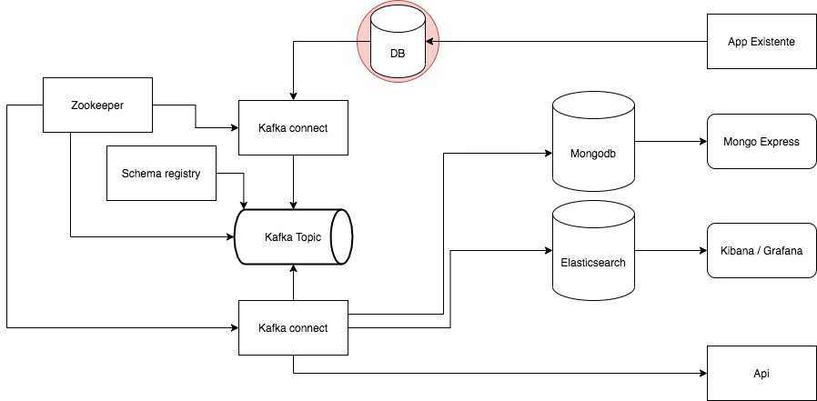

# Uma arquitetura um pouco diferente...



Inicie o compose com o comando `docker-compose up -d`. (você pode conferir os logs com o comando `docker-compose logs -f --tail=10`)

Entre no adminer (http://localhost:9090/) e crie uma tabela chamada teste com as colunas id (INT AUTO INCREMENT) e name (VARCHAR(255)).

Entre no shell do mongo e cadastre o banco e o usuário que fara o registro dos dados, pode seguir os comandos abaixo:
```sh
# Enter mongo shell
docker-compose exec mongodb -u root -ppassword
# In mongo shell
> use teste
> db.createUser({
...   user: "teste",
...   pwd:  "teste",
...   roles: [
...      { role: "readWrite", db: "teste" },
...   ]
... })
> exit
bye
```
Com isso já podemos partir para o control center(http://localhost:9921) para cadastrar os connectores, para isto você pode realizar o upload dos arquivos que se encontram na pasta `kafka-connect`.

Ao final deste processo você poder verificar que ao inserir dados na tabela no postgres, automaticamente os dados são levados para o mongo (visualizar pelo mongo-express http://localhost:9091), elasticsearch (visualizar pelo kibana http://localhost:5601) e para a chamada de api.

OBS.: Para o conector de API você pode mudar o parametro `http.api.url` do arquivo para apontar para um endpoint de teste seu (inclusive localhost!).

Enjoy!🎉